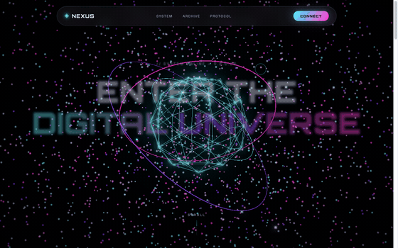

# Holographic-Interface

Three.js와 GSAP으로 만든 인터랙티브 원페이지 랜딩 사이트입니다. 셰이더 기반 파티클 유니버스를 배경으로, 스크롤에 따라 카메라가 움직이는 시네마틱 플라이스루와 글래스모피즘 UI를 결합했습니다.



## 주요 기능

- **WebGL 파티클 유니버스** — `THREE.Points` + 커스텀 GLSL 셰이더로 수천 개의 파티클이 구형으로 분포해 끊임없이 흔들립니다. (`src/scene.js`)
- **포스트프로세싱 블룸** — `EffectComposer` + `UnrealBloomPass`로 네온 발광 효과를 적용하고, 시간에 따라 강도가 미세하게 펄스합니다.
- **스크롤 연동 카메라 워크** — GSAP `ScrollTrigger`의 스크롤 진행도(`progress`)를 받아 카메라 위치/회전을 보간하는 시네마틱 플라이스루를 구현했습니다. (`src/main.js`)
- **포인터 반응형 코어** — 마우스 위치를 부드럽게 추적(lerp)해 중심부 아이코사헤드론·토러스 링이 자연스럽게 따라 움직입니다.
- **커스텀 커서 & 카드 틸트** — 듀얼 레이어 커서(dot + ring)와 마우스 위치 기반 3D 카드 틸트 효과.
- **로더 & 스크롤 리빌** — 진입 시 퍼센트 로더, `IntersectionObserver` 기반 섹션별 등장 애니메이션.

## 기술 스택

| 영역 | 기술 |
|---|---|
| 3D 렌더링 | [Three.js](https://threejs.org/) (`WebGLRenderer`, `ShaderMaterial`, postprocessing addons) |
| 애니메이션 | [GSAP](https://gsap.com/) + `ScrollTrigger` |
| 빌드 도구 | [Vite](https://vitejs.dev/) |
| 마크업/스타일 | 순수 HTML / CSS (프레임워크 없음) |

## 프로젝트 구조

```
.
├── index.html        # 페이지 마크업 (hero, features, showcase, cta, footer)
├── src/
│   ├── main.js        # GSAP 인터랙션: 로더, 스크롤 리빌, 커서, 카드 틸트, ScrollTrigger 카메라 제어
│   ├── scene.js        # Three.js 씬: 파티클 유니버스, 코어 지오메트리, 렌더 루프
│   └── style.css       # 글래스모피즘/네온 테마 스타일
└── docs/
    └── demo.gif         # 실행 데모
```

`scene.js`는 `createUniverse(canvas)`를 통해 `setCameraTarget()` / `setScrollRotation()` 두 개의 메서드만 외부에 노출하고, 나머지 렌더링 루프는 내부에서 자체적으로 `requestAnimationFrame`을 돌립니다. `main.js`는 이 두 메서드를 스크롤 진행도에 맞춰 호출해 3D 씬과 DOM 애니메이션을 동기화합니다.

## 시작하기

```bash
# 의존성 설치
npm install

# 개발 서버 실행 (http://localhost:5173)
npm run dev

# 프로덕션 빌드
npm run build

# 빌드 결과 미리보기
npm run preview
```

## 요구 사항

- Node.js (Vite 6 기준 18.x 이상 권장)
- WebGL을 지원하는 브라우저
